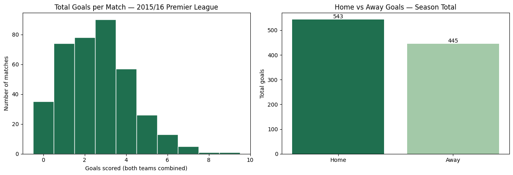
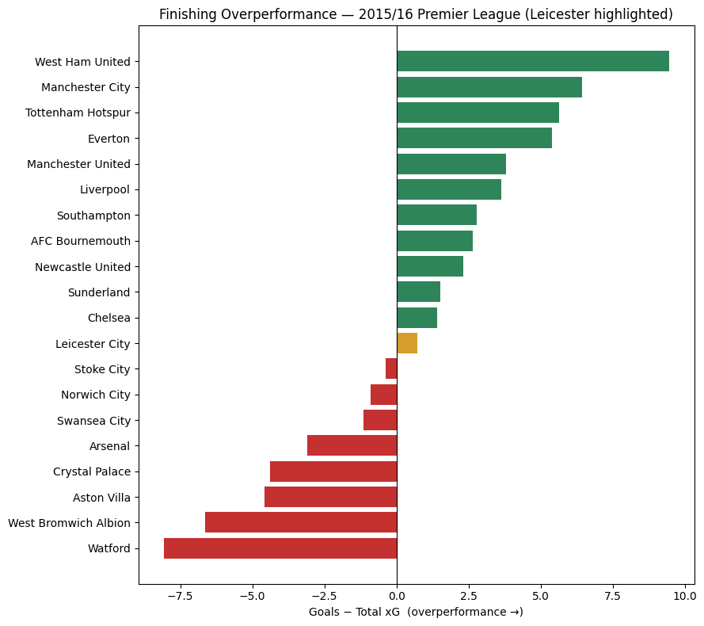
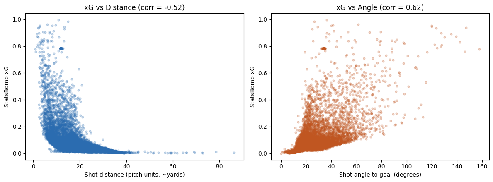
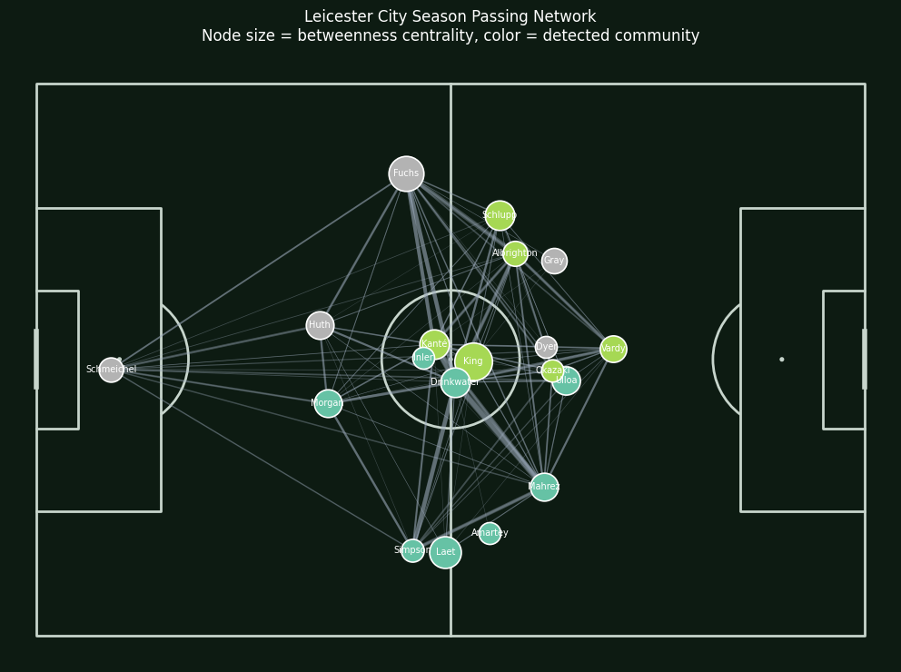

# ⚽ Elite Football Intelligence

**An end-to-end tactical, statistical, and machine learning analysis of football data — from raw event logs to a coach-facing report.**

**Case Study:** Premier League 2015/16 — Leicester City's Title-Winning Season
**Flagship Match:** Manchester City 1–3 Leicester City (6 February 2016)

---

## Overview

Football clubs generate enormous volumes of match data every season, but raw event logs don't answer the questions coaching staff, recruitment departments, and executives actually ask:

- *Why* did we win or lose, beyond the scoreline?
- *Which* patterns in our play — or an opponent's — are exploitable?
- *Who* should we sign, and can we defend that recommendation with evidence rather than reputation?

This project uses the **2015/16 Premier League season** as a case study for building the analytical infrastructure — metrics, models, and reporting — that a professional football analyst uses to answer exactly these questions, with **Leicester City's ~5000/1 title-winning campaign** as the throughline example: a genuine natural experiment in whether data-identifiable patterns (defensive compactness, counter-attack speed, chance quality vs. volume) can explain a result that squad-cost analysis alone cannot.

  

<em>Season-wide scoring baseline — goals-per-match distribution and the home/away split — used as context for every match- and team-level metric that follows.</em>

## What's Inside

| Section | Deliverable | Real-World Equivalent |
|---|---|---|
| Data Engineering | Validated, cached, analysis-ready dataset (380 matches) | Reproducible analytics pipeline |
| Advanced Metrics | xG, xA, PPDA, progressive actions, final-third entries, defensive line height | Weekly opposition scouting pack |
| Tactical Analysis | Shot maps, passing networks, pressure heatmaps | Match analysis deck |
| Player Performance | Per-90 normalized stats, percentile radar charts | Squad review for technical director |
| Network Analysis | Graph-theoretic passing network (centrality, playmaker detection, community detection) | Structural team-shape analysis |
| Machine Learning | Custom xG model (Logistic Regression + Gradient Boosting), SHAP interpretation, benchmarked vs. StatsBomb's proprietary xG | Internal rating model |
| Recruitment Insights | Player style clustering, "hidden gem" detection, similarity search | Scouting shortlist for a sporting director |
| Coach Report | Evidence-based tactical briefing for the flagship match | Pre-match coaching document |

## Key Findings

- **Leicester won on chance quality, not chance volume** — bottom-quartile possession share and pass accuracy, paired with competitive-to-strong final-third progression and shot quality: the statistical signature of a deliberate, direct, counter-oriented identity rather than a weaker team that got lucky.

  

    
  

  
<em>Leicester's goals-minus-xG sits modestly positive and mid-table — the title wasn't finishing-luck-driven the way the top overperformers suggest; it came from elsewhere in the game model.</em>

- **A custom xG model built on six interpretable features** reached ROC AUC within a reasonable range of StatsBomb's proprietary model (0.75–0.76 vs. 0.79) — meaningful predictive power from simple geometry/context features alone, with the residual gap plausibly explained by freeze-frame defender-positioning data this project didn't use.

  

    
  

  
<em>The two strongest geometric predictors behind the custom xG model: shot distance (corr = -0.52) and shot angle to goal (corr = 0.62) — the basic shape the model, and any sensible xG model, has to learn.</em>

- **Graph centrality surfaced Leicester's "hidden" structural playmaker** — not the headline creative names, but a squad-rotation midfielder whose passing connections spanned every regular teammate across different lineup combinations. Investigated and explained, not just reported.

  

    
  

  
<em>Season-long passing network — node size is betweenness centrality, color is detected community — showing King and Drinkwater as the structural hub linking Leicester's back line, midfield, and front line.</em>

- **Recruitment-style clustering recovers a repeatable signal**: high-output players outside the traditional "big six," statistically resembling Leicester's own title-winning recruits (Kanté, Mahrez, Vardy) before market/contract data would be layered on top.

## Methodology

- **Data source:** [StatsBomb Open Data](https://github.com/statsbomb/open-data) via the `statsbombpy` API, event-level granularity across the full 2015/16 Premier League season (~380 matches).
- **Validation-first pipeline:** every derived dataset is cross-checked against an independent ground truth (official scorelines) before being used in modeling, with explicit missing-value, duplicate, and consistency reporting.
- **Metrics built from scratch** following public analytics conventions (progressive actions = ≥25% closer to goal; PPDA computed in team-relative coordinate frames; defensive line height as an event-based proxy in the absence of tracking data) — every convention is stated explicitly, not assumed.
- **Machine learning evaluated honestly**: held-out test set, compared directly against StatsBomb's own xG as a fair external baseline, with SHAP used to confirm the model learned football-sensible relationships rather than just checking accuracy in isolation.
- **Every claim traces back to a specific, reproducible cell** — the closing Coach Report and Conclusions sections cite the exact prior section supporting each finding rather than asserting anything new.

## Tech Stack

`Python` · `pandas` / `NumPy` · `statsbombpy` · `matplotlib` · `mplsoccer` · `scikit-learn` · `SHAP` · `NetworkX` · `PyArrow`

## Project Structure
